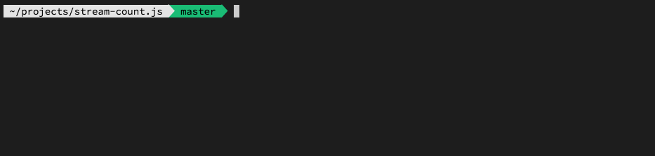

# StreamStat

Output statistics about data from stdin while redirecting the data to stdout.
The statistics are bytes read, bytes read per second, lines read, lines read per
second and total seconds.



## Usage

```sh
cat /dev/random | npx github:peterwmwong/stream-stat > /dev/null

gunzip -c /path/to/file.gz | npx github:peterwmwong/stream-stat > /path/to/unzipped
```

## Installation

Install to your project

    $ npm install stream-stat

## License

The gem is available as open source under the terms of the [MIT License](http://opensource.org/licenses/MIT).
